# 加密流量分析方法

## 加密流量分析常用数据集

这里我们列举一些常用的加密流量分析数据集：

1. **ISCX VPN-nonVPN**：
   ISCX VPN-nonVPN 数据集是一个广泛用于网络流量分类研究的公开数据集，它包含了VPN和非VPN流量。这个数据集分为两个子集：ISCX-VPN-App和ISCX-VPN-Service，分别包含17类和12类不同的应用和服务。这个数据集对于研究如何区分VPN流量和非VPN流量非常有用，尤其是在加密流量日益增多的背景下。

2. **ustc-tfc2016**：
   USTC-TFC2016数据集包含20类不同的网络流量，它在网络流量分类研究中得到了广泛应用，尤其是在评估深度学习模型性能时。这个数据集提供了丰富的流量样本，使得研究人员能够测试和比较不同分类算法的效果。

3. **app60**：
   app60数据集包含60类（实际实验中常用58类）不同网络应用流量的较大型数据集，为研究人员提供了更广泛的分类选择。这个数据集的特点是类别丰富，能够覆盖更多的网络应用，适合用于复杂网络环境下的流量分类研究。

4. **AWF模型**：
   AWF模型数据集包含Closed World、Open World、Concept drift等流量，有100、200、500、900个类别的分梯度的标注数据，每个类别有2500条数据。这个数据集设计用于测试和评估流量分类模型在不同复杂度和变化环境下的表现。

5. **Deep Fingerprinting数据集**：
   这个数据集包含95个类别，训练集有75000多个样本，测试集和验证集还各有9500条样本。Deep Fingerprinting数据集以其大规模和多样性被用于深度学习模型的训练和测试，特别是在流量指纹分析领域。

7. **UMass2**：
   UMass2提供了与Tor流量和HTTPS流量相关的数据集。这个数据集被用于研究如何在流量加密的情况下进行有效的流量分类和识别。

8. **ISCX Tor-NonTor**：
   ISCX Tor-NonTor数据集专注于The Onion Routing (Tor)流量，包括八种不同类型的Tor流量。这个数据集对于研究Tor流量的特征和分类方法非常有用，尤其是在Tor流量日益增多的背景下。数据包含原始的pcap文件和基于CICFlowMeter提取的表格型数据，我们后面会在这个数据集上展开实验。

## 基于深度包检测的加密流量分析

基于深度包检测(Deep packet inspection, DPI)的加密流量识别技术, 即通过判断流量数据包有效载荷中是否包含某种有效签名来实现流量识别。DPI通过建立不同流量类别的规则及签名来实现流量匹配, 因此具有高识别率及低误报率的特点。目前, 已出现大量成熟的基于DPI的流量识别工具。

- PACE是一种集成多种流量识别技术开发的C语言商用软件库, 它基于DPI，可对数千种网络协议和应用程序进行检测并实时提取元数据。具体来说, PACE支持URL、可执行文件、宽带使用率、持续连接时间、抖动、吞吐量等5500多个元数据参数的提取, 同时可利用这些内容参数实现协议识别(HTTP、SSL、BitTorrent等)、应用程序识别(Facebook、Skype、Spotify等)以及应用内服务识别(Skype视频通话、Skype短信等)。此外, PACE支持每周协议和签名更新, 具有高识别率特征。
- NBAR或NBAR2是Cisco基于DPI技术实现的商用应用程序识别库, 根据数据包头预定义字段提取特征, 支持超过1000个应用程序签名。NBAR可实现对Skype和Tor等匿名应用程序、ms-lync等业务应用程序、office-365等云应用程序、Facetime等移动应用程序以及基于Web或动态端口分配等难以分类的应用程序进行分类。NBAR通过每月发布的协议包来添加或更新签名库。同时, NBAR可根据静态分配的属性来匹配协议或应用程序, 并将协议或应用程序划分为不同的组来应用QoS策略。

- nDPI是基于OpenDPI的经典DPI开源库, 根据LGPL许可发布, 旨在添加新协议来扩展原始库。nDPI允许对应用层协议进行检测, 为每个协议设置签名扫描器, 通过签名扫描器检查数据包来实现协议匹配。目前nDPI支持200多种协议的识别, 为了支持加密连接的检测, nDPI通过添加SSL服务端和客户端的证书解码器来使用加密证书检测已加密的协议, 例如Citrix Online和Apple iCloud之类的协议。然而, 由于nDPI不支持TCP或IP有效载荷的重组, 因此无法检测到被分成多个TCP/IP数据包的签名。此外, 由于协议规范经常更新, 尤其是P2P协议, 因此需要对nDPI的签名库不断更新。
- Hyperscan是Intel开发的一个可用于商用服务器的高性能正则表达式匹配库, 遵循常用PCRE库的正则表达式语法, 根据BSD获得许可。Hyperscan采用两种核心技术来进行有效的模式匹配。首先, 它利用图分解将正则表达式匹配转换为一系列字符串和有限自动机匹配。其次, Hyperscan使用SIMD操作加速了字符串和有限自动机匹配, 从而显著提高了吞吐量。

Snort是一款开源的网络入侵检测和预防系统。

Snort主要有以下三种工作模式:

- 嗅探模式(Sniffer Mode)：Snort会捕获网络上的数据包并在屏幕上显示。这类似于使用tcpdump等工具进行数据包嗅探。
- 数据包记录模式(Packet Logger Mode)：Snort会将捕获的数据包保存到磁盘上,形成pcap格式的日志文件。这样可以对历史数据进行分析。
- 网络入侵检测模式(NIDS Mode)：Snort会根据预先定义好的规则对网络流量进行分析,一旦发现可疑的攻击行为就会发出警报。这是Snort最核心的功能。

Snort使用基于规则的语言来定义检测规则。这些规则包括规则头和规则选项两部分。规则头定义了协议类型、源IP、源端口、目的IP、目的端口等信息。规则选项则包括告警信息、匹配内容、TCP标志等更细节的检测条件。

## 基于机器学习的加密流量分析

机器学习在加密流量分析中有着广泛的应用。下面是一些机器学习算法在加密流量领域的应用，扇形图代表了近些年的论文中使用方法的比例。

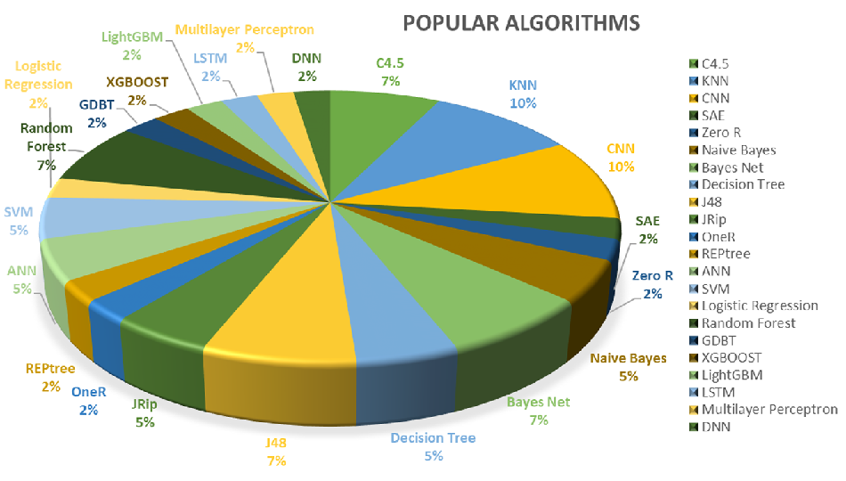

-   朴素贝叶斯方法是一种基于贝叶斯定理和条件独立性的分类方法。之所以称之为“朴素”，是因为它假设特征之间是相互独立的。它能够对分类和决策问题进行概率推断。在加密流量分类领域，朴素贝叶斯分类器因其简单性和有效性被广泛研究和应用。一些研究表明，朴素贝叶斯分类器在加密流量分类中扮演着重要角色，无论是在识别特定的通信服务、操作系统还是应用程序，都能提供有效的解决方案。通过结合流量特征和朴素贝叶斯分类器，研究人员能够提高对加密流量的识别准确率，这对于网络安全和隐私保护至关重要。

-   KNN是一种常用的监督学习方法。给定目标样本，它会找出最近的k个样本，并根据这些邻近样本来预测信息。距离计算方法包括欧几里得距离、曼哈顿距离等。在加密流量分类领域，KNN（K-Nearest Neighbors）算法被广泛应用于识别和区分不同类型的网络流量。在视频加密流量QoE、Tor分类等任务中，KNN都是常见的对比模型。

- SVM是一种灵活的监督学习算法，既可以用于分类也可以用于回归。为了解决复杂的分类问题，SVM 使用核函数将低维空间的特征映射到高维空间。常见的核函数包括线性核、多项式核、高斯核和Sigmoid核。在加密流量分类的研究领域，支持向量机（SVM）作为一种有效的机器学习算法，被广泛应用于各类研究工作。一些表明，SVM在处理加密流量分类任务时，无论是在无线网络、网站指纹分析，还是在视频流识别方面，都展现出了强大的分类性能和适应性。

- 决策树（DT）由有向边和节点组成，这些节点包括根节点、内部节点和叶节点。从根节点到每个叶节点的路径对应于一个决策序列。用于决策树的常用算法有ID3、C4.5和CART。在加密流量分类的研究中，决策树算法被广泛应用于识别和分类不同类型的网络流量。决策树算法在加密流量分类中同样有重要作用，能够有效地处理复杂的流量特征并提供可靠的分类结果。

- 随机森林（RF）是传统决策树（DTs）的集合。鉴于决策树容易过拟合的缺陷，随机森林采用了基于多个决策树的投票机制来改进。具体来说，随机森林中的每棵树都是通过从原始数据集中抽取的子数据集来训练的，然后通过所有决策树的投票获得最终结果。随机森林算法在加密流量分类领域展现出了其强大的分类能力和高准确性。在视频应用的加密流量QoE方面，随机森林是一种被广泛应用的baseline模型。此外，随机森林还被用于智能家居设备和Android应用程序的用户行为识别，以及通过分析加密网络流量识别微信红包和资金转移。

- XGBoost是一种基于梯度提升树的集成学习方法，在原始GBDT的基础上通过对残差项进一步学习提升模型精度，并在这一基础上给出了一种并行化训练梯度提升树的方法，使其不仅在准确率上打败其他机器学习方法，还有着非常好的训练速度。这一模型也在加密流量分析中取得了重要应用。

-  马尔可夫模型是一种随机模型，它给出了随机状态变化的概率。它由状态、状态转移概率和初始概率分布组成。一阶马尔可夫模型假设当前状态仅依赖于前一个状态，与之前的状态无关。那么说到马尔可夫模型，就不得不提到我们组的一篇工作了。MaMPF这篇工作，主要就是针对SSL/TLS加密流量，基于多属性马尔可夫模型构造的一种指纹识别方法。这个方法考虑到一个属性，就是序列的数据包长度（称作length block sequence），这个特征可以基于幂律分布和关联概率来刻画。 基于消息类型和长度块序列，训练马尔可夫模型，并将所有应用的概率串联起来作为分类的指纹。 

**MaMPF: Encrypted Traffic Classification Based on Multi-Attribute Markov Probability Fingerprints**

-   k-Means 是一种常用的聚类算法。它根据对象到聚类中心的距离将每个对象分配到最近的聚类中，然后重新计算中心。这个过程会一直重复，直到收敛，最终所有对象被划分为k个聚类，这一方法也为加密流量分析提供了新的思路，尤其是在新环境中存在不断变化的加密模式，无监督方法将会为这一任务提供不少可借鉴的点。

整体上，使用机器学习进行加密流量分析的步骤如图所示：

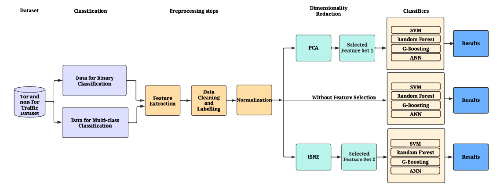

## 基于深度学习的加密流量分析

传统的机器学习方法通常需要人工选取特征，且需要大量的领域专业知识。随着网络中海量数据的增加，网络带宽的提升，数据的复杂性和特征的多样性也在不断提升，浅层学习难以达到分析和预测的目的。与传统机器学习不同, 深度学习方法学习的是样本数据的内在规律和表示层次, 构建多个隐藏层组建的非线性网络结构能够适应较高维度学习和预测的要求, 效率更高, 节省了大量特征提取的时间, 可以根据问题自动建立模型, 不局限于某个固定的问题。

### CNN

卷积神经网络（CNN）是一种深度学习模型，主要用于处理具有网格状拓扑结构的数据，如图像。其基本原理包括以下几个步骤：

1. **卷积层（Convolutional Layer）**：使用一组可学习的滤波器（或称为卷积核）在输入数据上滑动，计算滤波器与输入数据的局部区域的点积，生成特征图（feature maps）。数学上，如果输入数据是$ I $，滤波器是$ K $，那么卷积操作可以表示为$ F = I * K $，其中$ * $表示卷积操作。

2. **激活函数（Activation Function）**：对卷积层的输出应用非线性激活函数，如ReLU（Rectified Linear Unit），以引入非线性，增强模型的表达能力。

3. **池化层（Pooling Layer）**：通常在卷积层之后，用于降低特征图的空间维度，减少参数数量和计算量，同时提取重要特征。常见的池化操作有最大池化（Max Pooling）和平均池化（Average Pooling）。

4. **全连接层（Fully Connected Layer）**：在网络的末端，将特征图展平并连接到全连接层，这一层负责学习特征之间的复杂关系，并进行最终的分类或回归。

5. **损失函数（Loss Function）**：在训练过程中，通过损失函数（如交叉熵损失）来衡量模型预测与实际标签之间的差异，并利用反向传播算法更新网络权重。

CNN通过这些层的堆叠和组合，能够自动学习数据中的层次特征，从而在图像识别、分类等任务中表现出色。当然，这也是在网络流量领域被广泛应用的模型架构。例如，重庆大学的团队提出了一种新颖有效的加密流量分类模型CAD-Net。该模型基于残差卷积网络ResNet-18，并引入了信道注意力机制（CAM）和可变形卷积技术（DCT），以提高模型对关键特征的关注和提取流量字节间隐式特征的能力。此外，文章还设计了一种类感知加权交叉熵损失函数（CAWCE），以提高模型在类不平衡情况下的分类性能。这一模型旨在提高5G环境中加密流量分类任务的准确性。

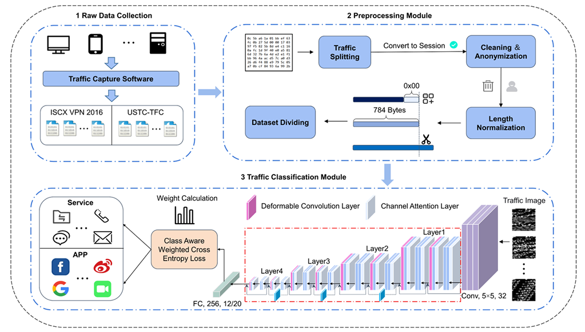

**A novel and effective encrypted traffic classification method based on channel attention and deformable convolution**

### RNN与LSTM

循环神经网络（RNN）是一种用于处理序列数据的神经网络，其基本原理是将前一个时间步的输出作为当前时间步的输入之一，从而在序列的不同时间步之间传递信息。数学上，对于一个简单的RNN单元，其更新公式可以表示为：

$$ h_t = /sigma(W_{hh}h_{t-1} + W_{xh}x_t + b_h) $$
$$ y_t = W_{hy}h_t + b_y $$

其中，$ h_t $是时间步$ t $的隐藏状态，$ x_t $是时间步$ t $的输入，$ W_{hh} $和$ W_{xh} $是权重矩阵，$ b_h $和$ b_y $是偏置项，$ /sigma $是非线性激活函数，$ y_t $是输出。

然而，传统RNN在处理长序列时会遇到梯度消失或梯度爆炸的问题。长短期记忆网络（LSTM）通过引入门控机制来解决这些问题。LSTM单元的核心是三个门：遗忘门、输入门和输出门。其更新公式如下：

- 遗忘门：
  $$ f_t = /sigma(W_f /cdot [h_{t-1}, x_t] + b_f) $$

- 输入门：
  $$ i_t = /sigma(W_i /cdot [h_{t-1}, x_t] + b_i) $$
  $$ /tilde{C}_t = /tanh(W_C /cdot [h_{t-1}, x_t] + b_C) $$

- 单元状态更新：
  $$ C_t = f_t * C_{t-1} + i_t * /tilde{C}_t $$

- 输出门：
  $$ o_t = /sigma(W_o /cdot [h_{t-1}, x_t] + b_o) $$
  $$ h_t = o_t * /tanh(C_t) $$

在这里，$f_t $、$ i_t $、$ o_t $分别是遗忘门、输入门和输出门的激活向量，$ C_t $是单元状态，$ /tilde{C}_t $是候选单元状态，$ W $和$ b $分别表示权重和偏置，$ /sigma $是sigmoid激活函数，$ /tanh $是双曲正切激活函数。LSTM通过这些门控机制有效地控制信息的流动，使得网络能够学习到长期依赖关系。

RNN和LSTM同样在加密流量领域有着重要应用。因为再怎么说，流量本身也是序列，对序列的建模那么LSTM就必然是可以胜任的。这里我也一样介绍一个利用RNN进行加密流量分类的工作吧，是浙江大学和中国科学院信息工程研究所合作的一篇工作。这篇论文核心解决的问题是在加密流量分类任务中出现的增量式类别，也就是在分类的过程中由于加密技术或类别本身的不同导致越来越多的新模式出现，而传统的监督学习拿这个问题没有办法。因此，这个工作提出I2RNN，一个增量和可解释的循环神经网络，用于加密流量分类。该研究旨在解决加密流量分类中的增量学习问题，并提供一个可解释的模型来帮助理解分类决策。I2RNN提出了更好的训练策略来从会话中提取指纹，在面对增量任务时只需要进行小小的额外训练就可以很好地适配。

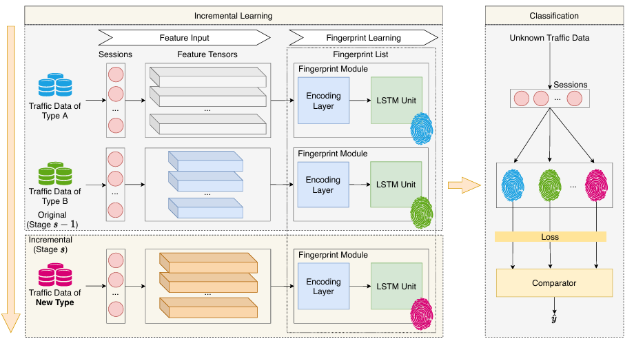

**I² RNN: An Incremental and Interpretable Recurrent Neural Network for Encrypted Traffic Classification** 

### 一些生成式方法

常见的生成式深度学习架构包括自编码器（AE）、受限玻尔兹曼机（RBM）和深度信念网络（DBN）。自编码器（AE）通过一个编码器将输入数据压缩成一个低维表示，然后通过一个解码器重建输入数据，其目标是最小化输入和重建之间的差异。受限玻尔兹曼机（RBM）是一种由可见层和隐藏层组成的两层神经网络，通过学习输入数据的概率分布进行特征学习，其能量函数定义为：

$ E(v, h) = - /sum_{i,j} w_{ij} v_i h_j - /sum_i b_i v_i - /sum_j c_j h_j $

其中/( v /)是可见层状态，/( h /)是隐藏层状态。深度信念网络（DBN）是由多个RBM堆叠而成的深层生成模型，通过无监督预训练学习层次化的特征，然后可以进行有监督微调以适应特定任务。

在加密流量分类中，这些生成式深度学习架构可以用于自动提取流量数据的特征，从而进行分类。例如，DBN可以用于无监督的特征学习，以捕捉输入数据的有用表示，进而用于加密流量的分类。AE可以用于学习流量数据的有效表示，而RBM作为DBN的基本构建块，可以捕获数据的特定特征。这些方法通过学习数据的内在结构和模式，提高了加密流量分类的准确性和效率。

论文"**Network traffic classification using deep convolutional recurrent autoencoder neural networks for spatial–temporal features extraction**"就提出了一种基于自编码器的深度神经网络架构，该架构通过嵌入卷积和循环神经网络来挖掘基本特征之间的关系（空间特征）及其随时间的演变（时间特征）。这些知识可以成功地被基于机器学习的分类器利用。通过在真实网络流量数据集上的实验，研究表明，通过将自编码器与全连接神经网络堆叠，平均准确率比一些基于机器学习的NTC方法提高了28%，比纯卷积和循环堆叠神经网络提高了10%，比纯前馈网络提高了18%。即使在训练数据集不平衡的情况下，该方法也能保持高准确率。

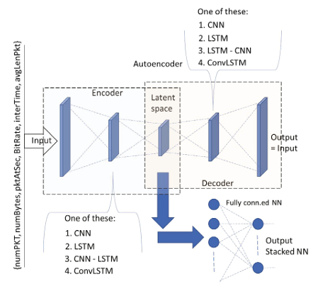

### 图神经网络

图神经网络在网络数据上有很好的效果。在计算机网络领域，可以将主机、IP、端口等视作节点，而一次发送就可以抽象为图。当然，也有更多更加好的图建模，例如异质图、时空图等等，都可以用于网络流量领域。通过图神经网络，我们可以学习到节点与边的嵌入表示，从而学习到网络图的结构信息。这些结构信息的引入会对加密流量分析有重要的帮助。

图神经网络在加密流量分类中也有广泛的应用，这里我推荐给大家几篇文章可以参考阅读：

1. **A graph representation framework for encrypted network traffic classification** 
    该研究提出了一种基于图表示的加密网络流量分类框架。研究者通过利用图的强大表达能力，在不同粒度级别上表示网络流量，专注于NTC中的特征提取和表示。通过将网络流量建模为相互连接的图，可以分析流级和包级数据。该方法在加密NTC中的图表示有效地保留了关键信息，尽管存在加密和混淆。通过使用余弦相似性来利用加密网络流和数据包之间的相关性，定义了抽象实体之间的关系。这种图结构使得能够创建准确定义不同加密级别的网络流量的结构嵌入。端到端流程在传统NTC方法挣扎的地方展示了显著的改进，例如在Tor分类中，其采用匿名化进一步混淆流量。包级分类方法一致地超越了现有方法，准确率超过96%。

  

2. **CGNN: Traffic Classification with Graph Neural Network** 
    该论文提出了一种基于图神经网络的流量分类方法CGNN，它在自动提取的特征上构建图分类器。CGNN通过链式图模型保持了数据包流的链式组合序列。该方法在真实世界的流量数据集上进行了广泛的评估，包括正常、加密和恶意标签，表明CGNN在应用分类、恶意流量分类以及加密流量分类的预测准确性方面提高了23%到37%，并且在召回率和精确度指标方面相当稳健。

3. **EC-GCN: A encrypted traffic classification framework based on multi-scale graph convolution networks** 
    EC-GCN是一个基于多尺度图卷积网络的加密流量分类框架。该框架首先提供了一个轻量级层，仅依赖于元数据，并将每个加密流量流编码为图表示。然后设计了一种新颖的图池化和结构学习层，以动态提取多图表示，并提高适应复杂网络环境的能力。EC-GCN是一个端到端的分类模型，它学习隐藏在流量时间序列中的代表性空间-时间流量特征，然后在统一框架中对它们进行分类。在三个真实世界数据集上的实验表明，EC-GCN可以实现高达5%-20%的准确率提升，并超越了最先进的方法。

  

4. **TCGNN: Packet-grained network traffic classification via Graph Neural Networks** 
    TCGNN是一种基于图神经网络的流量分类方法，它将每个网络数据包转换为无向图。然后采用两层图卷积网络，并结合三种不同的聚合策略，从数据包转换的图中学习潜在的应用程序表示。TCGNN利用GNN在图表示学习方面的强大能力，可以以极高的准确率识别未知网络数据包。在两个真实世界的流量分类数据集上的广泛实验表明，TCGNN在现有数据包粒度的流量分类方法中具有优越的有效性。

  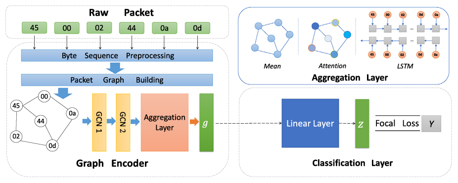

5. **A Temporal Fusion Encoder Using Graph Neural Networks for Fine-grained Encrypted Traffic Classification** 
    该研究提出了一种基于点互信息（PMI）的字节级流量图构建方法，以及一个名为Temporal Fusion Encoder使用图神经网络（TFE-GNN）的模型，用于特征提取。特别是，设计了一个双重嵌入层、基于GNN的流量图编码器以及交叉门控特征融合机制，可以先分别嵌入头部和有效载荷字节，然后将它们融合在一起以获得更强的特征表示。实验结果表明，TFE-GNN在细粒度加密流量分类任务中优于多种最先进的方法。

  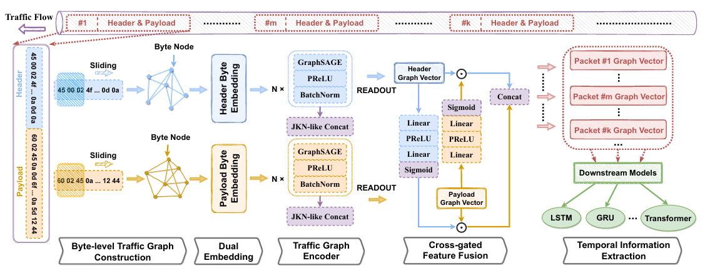

## 加密流量的数据增强技术

数据增强技术在加密流量分类中也有着重要的应用。没有好的数据，就没有好的模型效果。但网络中存在的各种问题（乱序、丢包、延迟等）相比于其他领域的数据挖掘任务而言，给数据质量带来了更多的挑战。不同类型的加密流量捕获后也会有不同的pcap包大小，一般而言，视频流应用、FTP应用等产生的流量体量往往比聊天这种应用要大不少。这就势必会造成加密流量分类中的数据失衡问题。

在视觉任务中，面对这些失衡问题，我们会选择Data Augmentation来进行处理。同时，针对网络真实场景中可能发生的种种意外，通过数据增强的方法来模拟更有助于算法迁移到真实环境中来。这里我同样介绍几篇文章为大家展示加密流量中的数据增强技术。

1. **"The art of time-bending: Data augmentation and early prediction for efficient traffic classification"**
   - **方法**：这篇文章介绍了一个创新架构，该架构将长短期记忆（LSTM）网络与基于图像的互联网流量表示相结合。模型能够扩展图像以生成新的、连贯的、语义相关的内容，从而显著丰富分类器的训练数据。通过训练网络生成输出，这些输出与原始图像相似但不是完全复制品，从而创建新的数据样本，保持其类别身份。这种方法促进了多样化数据样本的迭代生成，显著扩展了训练数据集。此外，模型还提供了一种减少分类时间的新方法。通过从原始流量数据和LSTM生成的内容合成新图像，创建了一个混合输入，可以被互联网流量分类器更高效地处理。这种架构的双重用途——作为数据增强工具和加速分类的手段——展示了其多功能性和潜力，以解决ITC领域的一些紧迫挑战。
2. **"GraphCWGAN-GP: A Novel Data Augmenting Approach for Imbalanced Encrypted Traffic Classification"**
   - **方法**：这篇文章提出了一种名为GraphCWGAN-GP的新数据增强方法，用于处理加密流量分类中的不平衡问题。首先，将流量数据转换为灰度图像作为模型的输入。然后，使用提出的模型对少数类数据进行增强，该模型通过在典型的GAN中引入条件约束和新的距离度量来构建。最后，采用经典的深度学习模型作为分类器，对由条件GAN（CGAN）、Wasserstein GAN-梯度惩罚（WGAN-GP）和GraphCWGAN-GP增强的数据集进行分类。与最先进的GAN方法相比，GraphCWGAN-GP不仅能控制生成数据的模式，还能克服不稳定训练的问题，并生成更真实和多样化的样本。实验结果表明，通过这种方法平衡的数据集中的少数类的分类精度、召回率和F1分数分别提高了超过2.37%、3.39%和4.57%。
3. **"Enhancing Encrypted Internet Traffic Classification Through Advanced Data Augmentation Techniques"**
   - **方法**：这篇文章提出了两种数据增强（DA）技术——平均增强（Average augmentation）和MTU增强（MTU augmentation），旨在基于真实样本合成生成数据，以改善分类器的性能。平均增强是一种结构增强方法，它取一组m个数据流作为输入，并计算一个新的流，其中每个时间戳的值（即数据包大小）是m个输入流中相应值的平均值，从而创建一个新的样本。MTU增强是一种基于网络的方法，该方法通过改变最大传输单元（MTU）来生成每个输入流的合成变体。例如，一些流量图构建方法假设了一个固定的MTU为1500字节。这种假设可能会限制模型性能，因为MTU的一个小配置更改可以使模型无法使用，为检测规避创造机会，并使系统暴露于安全漏洞，如第V节所示。MTU增强解决了DA的第二个目标：生成原始数据集中不存在的数据。
4. **"A Few Shots Traffic Classification with mini-FlowPic Augmentations" **：
   - **方法**： 这篇文章的研究动机是解决在互联网流量分类中标记数据集不足的问题。传统的深度学习方法，如基于FlowPic的卷积神经网络（CNN），需要大量的标记数据来训练模型，以避免过拟合。为了克服这一挑战，研究者提出了使用mini-FlowPic表示和数据增强技术。mini-FlowPic是一种简化版的FlowPic，它通过减少直方图的尺寸来降低图像的分辨率，从而减少模型训练所需的数据量。此外，研究者还提出了基于网络条件变化的数据增强技术，以模拟不同的网络环境，从而人为地增加训练样本的数量。当标记样本非常有限时，研究者建议采用对比表示学习，这是一种无监督学习方法，它通过学习数据的低维表示来使得相似的样本在嵌入空间中更接近，而不相似的样本则相距较远，从而提高分类器的性能。 （PS：大家如果想复现这篇文章，对比学习的框架可以使用SimCLR，并且有论文手把手复现过还发了顶会： Replication: Contrastive Learning and Data Augmentation in Traffic Classification Using a Flowpic Input Representation ，华为法国公司的工作）

## 加密流量的特征构造技术

在以前，我们往往是通过手工设计规则来提取加密流量的特征。后来有了机器学习，虽然提高了分类的效率，但特征的设计和筛选仍然是个大问题。深度学习方法的引入使得模型可以自动地学习特征。另外，对特征的分析也是目前加密流量分类模型可解释性很重要的部分。

对于加密流量领域的特征构造，我们同样推荐几篇可以阅读的文献：

1. **VPN and Non-VPN Network Traffic Classification Using Time-Related Features** 
   - 该研究专注于基于时间相关特征的VPN和非VPN网络流量分类。研究者提出了两种机器学习模型，利用统计特征、皮尔逊相关性以及遗传算法来提取和选择有价值的特征，以改善服务质量和网络管理，同时监督整体性能。该方法在最苛刻的流量分类任务中实现了超过95.02%的准确率。

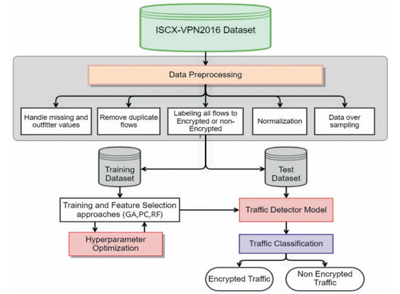

2. **A Deep Learning-Based Encrypted VPN Traffic Classification Method Using Packet Block Image** 
   - 这篇论文提出了一种基于深度学习的方法，使用数据包块图像对加密的VPN流量进行分类。该方法通过将连续的数据包聚合成数据包块，并利用这些数据包块的大小和长度特征来减少不同流量类型之间的特征冲突。然后，利用卷积神经网络（CNN）模型对这些图像进行分类。实验结果表明，该方法在ISCX-Tor数据集上的分类准确率达到了93.31%，在自行捕获的OpenVPN数据集上达到了97.20%。

3. **CENTIME: Targeting Encrypted Traffic Classification by Direct Composite Traffic Feature Extraction** 
   - 这篇文章提出了一种综合流量特征提取框架，用于加密流量分类。文章首先通过会话数据包对原始流量进行预处理和匿名化，然后提取26个统计特征（例如数据包长度、时间差、IP标志等 ）以补偿因流量修剪造成的信息丢失。接着，利用ResNet从统一化的流量中提取深层特征，并通过AutoEncoder压缩统计信息以保留流量的整体结构。最终，将这些特征合并形成综合特征，用于提高加密流量的分类准确性。CENTIME框架通过直接从原始流量中提取特征，避免了因预处理导致的信息丢失，从而在加密流量分类任务中取得了优于现有方法的性能。 

## 计算机视觉与自然语言处理对加密流量的启发

计算机视觉与自然语言处理方法对加密流量分类任务其实也产生了很大的启发。大家知道，早期加密流量分析更多的是通过计算机网络方面基础知识打底，通过手工设计或统计学方法来人为地抽取pcap文件中的特征，也就是把pcap抽象成了表格形式。大家参加过天池，参加过kaggle，Datawhale也开放不少学习性的数据挖掘比赛供同学们上分。大家也就自然而然知道，在表格任务当中很多神经网络方法都是干不过XGBoost这些树模型的。似乎我们用XGBoost就可以在各种各样的加密流量任务（VPN、Tor、QUIC等等）当中乱杀四方了，该用的方法也就用到头了，不能解决的问题就再也不能解决了。这就让我们陷入了一个瓶颈。

然而，事实真的是这样吗？

计算机视觉方法为流量分类带来了新的血液。pcap数据包本身说穿了也就是二进制流文件，引入一些视觉的方法，将pcap文件转化为图像来处理，就可以把加密流量分类抽象为图像分类问题，从而使用各种各样的图像分类模型。在后面实战环节，我们可以带着大家把流量简单地转换为灰度图，然后用ResNet-18来对Tor流量做分类，效果很好的哟。

也就是这些新鲜血液的引入，使得更多的机器学习技巧可以被引入到流量分类当中来（例如对比学习、迁移学习、增量学习、小样本学习等等）。在后来应对其他流量有关的任务时（例如APT检测），知识蒸馏、自监督学习等方法也被引入进来，从而使得以前一些难以被建模的流量难题可以被分析。

这里我想以ViT-BiGAN这个工作为例为大家介绍一下视觉任务在加密流量中的应用。

**Detection of obfuscated Tor traffic based on bidirectional generative  adversarial networks and vision transformer **这篇文章的工作动机在于解决Tor网络中混淆流量的检测问题。Tor网络通过一系列节点路由互联网流量以保护用户的匿名性和隐私，但这也使得一些人可能利用混淆流量隐藏其网络活动，甚至进行非法活动，如在暗网上买卖非法商品或访问非法服务。尽管有努力识别和阻止Tor流量，但由于识别特征集有限，导致误报和漏报问题。为了应对这些挑战，文章提出了一种新的方法，使用视觉transformer（ViT）和双向生成对抗网络（BiGAN）增强。这种方法通过ViT对流量数据进行视觉变换，然后利用BiGAN进行数据增强，以提高模型对混淆Tor流量的识别能力。在效果方面，该方法在ISCX-Tor2016数据集上表现出色，达到了99.59%的准确率、99.83%的召回率、99.72%的精确度和99.78%的F分数，超越了当前最先进的技术。

除了视觉方法的应用外，文本方法也给加密流量很大启发。在大家先拿中文、英文这样的自然语言为突破点探究了文本分类、序列标注、NER、机器翻译、机器阅读理解、QA、文本生成等问题后，大家的魔爪就不局限于自然语言了，而是追求更广义的“语言”。例如，NLP取得成功后，就有学者着手开始将NLP方法用在代码语言领域，做代码自动纠正、代码生成，更进一步地，聚焦在SQL当中去探索NL2SQL的一些方法（这里我再给Datawhale一位非常厉害的老成员打个广告，DW武汉分部的易显维老师，常年担任大厂高级算法工程师，有个人著作两部，都是聚焦NL2SQL技术的，欢迎大家阅读）；还有学者开始探索从自然语言到数学语言的一些方法，着手运用NLP模型对数学问题进行建模和探索；在网络安全领域，也就自然而然地开始有人考虑将报文视作一种“语言”，将NLP方法应用在加密流量领域。我们课题组的代表性工作之一——ET-BERT正是基于这样的想法诞生的。

## 预训练与大语言模型技术在加密流量分析中的探索

这一小节我们来看看预训练方法和大语言模型在加密流量中的应用。

### 预训练方法

1. **FlowFormers: Transformer-based Models for Real-time Network Flow Classification** 

该研究提出了一种基于Transformer的模型，用于实时网络流量分类。FlowFormers模型利用了Transformer架构的自注意力机制来捕捉流量数据中的长距离依赖关系，从而提高了分类的准确性。该模型在多个数据集上进行了测试，包括加密流量，展示了其在实时网络流量分类中的有效性。工作动机在于解决网络流量分类（NTC）中的两个关键挑战：高速和细粒度的特征提取，以及深度学习（DL）模型对行为流量模式的高效学习。随着数据速率的快速增长和流量加密的普及，NTC越来越依赖于使用深度学习技术推断出的概率行为模式。为了克服这些挑战，文章提出了一种新颖的网络行为表示方法FlowPrint，它能够提取每个流量的时间序列字节和包长度模式，并且与包内容无关。在实时大学网络流量上实现并评估了FlowPrint和FlowFormers，展示了在前10秒内对流行应用类型进行分类达到了95%的f1分数，在前30秒内上升到97%，并在视频和会议流中识别提供商达到了95%以上的f1分数。

2. **ET-BERT: A Contextualized Datagram Representation with Pre-training Transformers for Encrypted Traffic Classification** 

以往的一些方法高度依赖标记训练数据的数量和分布，容易导致模型偏差，并且难以适应新出现的加密模式。近来的一些工作直接应用了预训练技术，并在VPN流量分类上获得了明显的改善，但缺乏为流量设计的预训练任务和合理的输入表示以展示预训练模型的效果。于是，ET-BERT模型诞生了（这也是我们课题组的代表工作之一），它是一个基于Transformer的预训练模型，用于加密流量分类。ET-BERT通过自监督学习在大规模未标记的加密流量上学习数据报级别的通用流量表示。该模型在五个加密流量分类任务上实现了最先进的性能，显著提高了ISCX-VPN-Service的F1分数至98.9%。

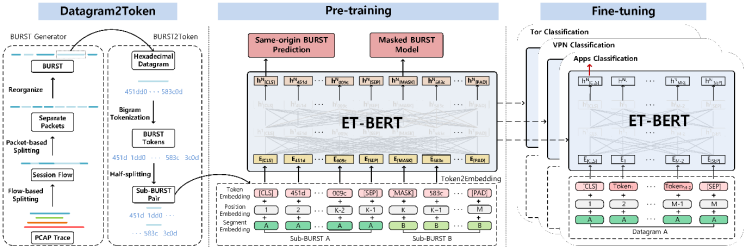

 ET-BERT模型的工作原理可以概括为4个：数据预处理、模型预训练、模型微调、模型测试。

1）数据预处理。将原始加密流量数据转化为适合BERT模型输入的格式，包括分词、标记化等。Datagram2Token 方法

2）模型预训练。使用大规模跨域的未标记加密流量数据对ET-BERT模型进行预训练。该训练过程不会受到样本不足的限制，使模型学习到加密流量数据中的统计规律和语义表示。（两个预训练任务，如掩码 BURST 模型和同源 BURST 预测，从过渡上下文中学习上下文化的数据报表示）

3）模型微调。使用少量带有标记的样本对预训练模型微调，以适应特定的下游任务。论文中使用了7个数据集验证了5个任务。

4）模型测试。将测试样本输入到微调模型中，模型输出预测标签。

3. **PERT: Payload Encoding Representation from Transformer for Encrypted Traffic Classification** 

PERT模型是另一个基于Transformer的加密流量分类方法。该模型利用Transformer架构来学习加密流量的有效表示，并且能够在不同的加密流量场景中实现准确的分类。PERT模型在多个数据集上进行了测试，包括新的TLS 1.3数据集，展示了其在不同加密协议下的泛化能力。 这种方法采用了一种动态词嵌入技术——BERT（Bidirectional Encoder Representations from Transformers），在流量表示学习阶段进行应用。BERT在自然语言处理（NLP）领域取得了巨大成功，作者受到启发，认为计算机通信协议和自然语言有一些共同特征，因此尝试将这种强大的嵌入技术应用于编码流量负载字节，以期在处理加密流量分类任务时提供显著的性能提升。  通过在公共加密流量数据集和捕获的Android HTTPS流量上进行流量分类实验，文章证明了所提出的方法比其他比较基线具有更好的效果。 

4. **SecureBERT: A Domain-Specific Language Model for Cybersecurity** 

SecureBERT的方法设计基于BERT架构，通过在大量网络安全文本上进行预训练，使其不仅能够理解通用英语，还能够处理具有网络安全含义的文本（例如威胁情报CTI）。研究者们开发了一个定制的分词器，并引入了一种调整预训练权重的方法，以提高模型在网络安全文本上的表现。此外，SecureBERT在训练过程中引入了随机噪声到预训练权重，以优化重新训练过程，使其更有效地适应网络安全的上下文，尤其是在学习同音异义词和在不同领域具有多重含义的短语方面。在效果方面，SecureBERT在标准掩码语言模型（MLM）测试以及两个额外的标准NLP任务中进行了评估。评估研究表明，SecureBERT在解决网络安全领域的关键NLP任务方面优于现有的类似模型，证实了其处理网络安全和通用英语输入的能力。SecureBERT在预测网络安全相关文本中的掩码词汇方面优于现有模型，展示了其消化和解释领域内文本的能力。通过特定的策略，如开发定制分词器和权重调整，SecureBERT在保持通用语言理解的同时，提高了其性能。

5. **NetMamba: Efficient Network Traffic Classification via Pre-training Unidirectional Mamba**

广泛使用的Transformer架构具有二次复杂度；以及流量表示不充分，因为它们在保留不需要的偏差的同时丢弃了重要的字节信息。 为了应对这些挑战，清华大学的团队提出了NetMamba，这是一个高效的线性时间状态空间模型，配备了全面的流量表示方案。NetMamba采用了特别选择和改进的单向Mamba架构，而不是Transformer，以解决效率问题。此外，文章设计了一个流量表示方案，用于从大量流量数据中提取有效信息，同时去除有偏见的信息。  在六个公共数据集上的评估实验表明，NetMamba在分类性能上优于现有的最先进的基线。它在所有任务中的准确率接近99%（有些超过99%）。此外，NetMamba展示了出色的效率，推理速度提高了高达60倍，同时保持相对较低的内存使用。NetMamba还展现了卓越的少样本学习能力，即使在标记数据较少的情况下也能实现更好的分类性能。 这应该是目前为数不多采用Mamba架构的加密流量模型。

### 大语言模型技术

1. **NetGPT: Generative Pretrained Transformer for Network Traffic**

NetGPT是一种用于网络流量的生成预训练Transformer模型，旨在解决网络流量预训练模型的问题，以提高下游任务（如流量分类、攻击检测、资源调度、协议分析和流量生成）的训练效率和有效性。该研究的动机是应对网络流量的异构性和多样性问题，以及下游网络任务的不同依赖关系问题。NetGPT的关键思路是提出了一种多模式网络流量建模方法，通过将异构的网络流量头部和载荷编码为统一的文本输入，支持流量理解和生成任务。在预训练过程中，NetGPT使用基于十六进制的通用编码策略，将明文和加密流量转化为通用语义空间，构建了一个基础的预训练模型。在微调过程中，通过随机化头部字段、分割流中的数据包，并结合任务特定标签来优化模型，以适应不同的下游任务。实验结果表明，NetGPT在多种流量理解和生成任务中都具有很高的效果，并且比当前最先进的基准模型表现更好。此外，NetGPT还提供了数据集和代码，方便其他研究者进行复现和进一步研究。

2. **TrafficGPT: Breaking the Token Barrier for Efficient Long Traffic Analysis and Generation** 

TrafficGPT模型采用了生成预训练和线性注意力机制，这使得模型的令牌容量从512增加到12,032，显著提高了处理长流量序列的能力。该模型结合了ET-BERT和NetGPT的基础原理，并引入了优化令牌表示和增强神经网络架构的改进。 在分类任务中，TrafficGPT展现出了卓越的性能，达到了最先进的水平。在生成任务中，它能够生成与真实流量流非常相似的流量，具有低JS散度和接近0.5的F1分数（代表随机猜测），在区分生成数据方面表现出色。这些进步为未来在流量流分类和生成任务中的应用提供了希望。 

3. **NetLLM: Adapting large language models for networking**

NetLLM框架包含三个主要设计组件：多模态编码器、网络头部和数据驱动的低秩网络适应（DD-LRNA）方案。多模态编码器使LLM能够有效理解网络中的多模态信息；网络头部使LLM能够高效生成网络任务的答案；DD-LRNA方案基于数据驱动的强化学习和参数高效的微调，使LLM能够高效学习网络领域的特定知识。在视口预测（VP）、自适应比特率流（ABR）和集群作业调度（CJS）三个与网络相关的用例中，NetLLM适应的LLM显著超越了最先进的算法，分别提升了10.1-36.6%、14.5-36.6%和6.8-41.3%的性能，同时也展示了在未见测试环境中更强的泛化能力。

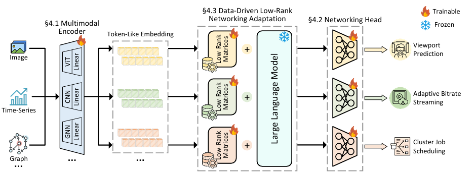

4. **ShieldGPT: An LLM-based framework for DDoS mitigation**

ShieldGPT是一项基于大型语言模型（LLM）的DDoS攻击缓解框架的研究工作。现有的机器学习方法在检测DDoS攻击方面显示出了潜力，但它们在阐明预测理由和提供可操作的缓解措施方面存在局限性，这限制了它们的实际应用价值。ShieldGPT通过利用LLMs的能力，旨在克服这些限制，提供更深入的攻击分析和缓解措施。ShieldGPT框架包含四个核心组件：攻击检测、流量表示、领域知识注入和角色表示。为了弥合LLMs的自然语言处理能力与网络流量复杂性之间的差距，研究者开发了一种表示方案，该方案能够捕捉全局和局部流量特征。此外，他们还探索了特定于网络领域的提示工程，并设计了两种提示模板，利用LLMs生成针对流量的、可理解的解释和缓解指令。在效果方面，ShieldGPT的初步实验和案例研究验证了其有效性和适用性，展示了它在提供细致洞察和定制策略方面增强DDoS缓解工作的潜力。该框架通过原型系统实现，并在公共DDoS数据集上进行了评估，证明了其在提供清晰的解释性分析和实际缓解指导方面的专业能力。研究者将ShieldGPT定位为未来开发自主DDoS缓解系统的一个重要起点，并认为这项研究为将LLMs应用于DDoS缓解领域提供了一个有意义的起点。

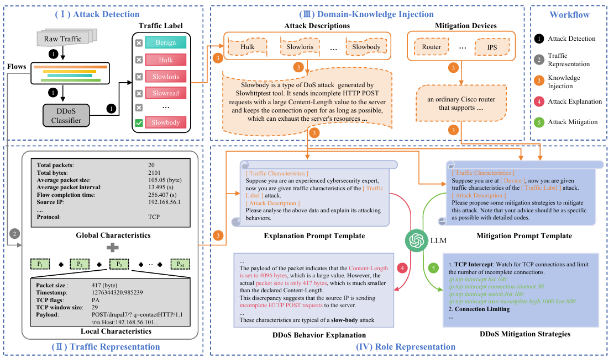

## 参考资料与文献

参考了中国科学院大学网络空间安全学院刘玉岭老师和姜波老师开设的《网络安全数据分析基础》课程内容，特别鸣谢！通过这门课我学到了很多东西，也希望能把自己吸收的一些知识整理出来。

下面是引用的论文链接。

1. Meng Shen, Ke Ye, Xingtong Liu, Liehuang Zhu, Jiawen Kang, Shui Yu, Qi Li, Ke Xu. Machine Learning-Powered Encrypted Network Traffic Analysis: A Comprehensive Survey. 
2. Liu C., Cao Z., Xiong G., Gou G., Yiu S., He L. MaMPF: Encrypted Traffic Classification Based on Multi-Attribute Markov Probability Fingerprints. 
3. Gudla R, Vollala S, Srinivasa K G, et al. A novel approach for classification of Tor and non-Tor traffic using efficient feature selection methods[J]. Expert Systems with Applications, 2024, 249: 123544.
4.  Zou A, Yang W, Tang C, et al. A novel and effective encrypted traffic classification method based on channel attention and deformable convolution[J]. Computers and Electrical Engineering, 2024, 118: 109406. 
5. Song Z, Zhao Z, Zhang F, et al. I $^{2} $ RNN: An Incremental and Interpretable Recurrent Neural Network for Encrypted Traffic Classification[J]. IEEE Transactions on Dependable and Secure Computing, 2023. 
6. Daoquan Li, Xueqing Dong, Jie Gao, Keyong Hu. Network traffic classification using deep convolutional recurrent autoencoder neural networks for spatial–temporal features extraction. 
7. Okonkwo Z, Foo E, Hou Z, et al. A graph representation framework for encrypted network traffic classification[J]. Computers & Security, 2025, 148: 104134. 
8.  Pang B, Fu Y, Ren S, et al. CGNN: traffic classification with graph neural network[J]. arXiv preprint arXiv:2110.09726, 2021. 
9.  Diao Z, Xie G, Wang X, et al. EC-GCN: A encrypted traffic classification framework based on multi-scale graph convolution networks[J]. Computer Networks, 2023, 224: 109614. 
10.  Hu G, Xiao X, Shen M, et al. TCGNN: Packet-grained network traffic classification via Graph Neural Networks[J]. Engineering Applications of Artificial Intelligence, 2023, 123: 106531. 
11.  Zhang H, Yu L, Xiao X, et al. Tfe-gnn: A temporal fusion encoder using graph neural networks for fine-grained encrypted traffic classification[C]//Proceedings of the ACM Web Conference 2023. 2023: 2066-2075. 
12.  Hajaj C, Aharon P, Dubin R, et al. The art of time-bending: Data augmentation and early prediction for efficient traffic classification[J]. Expert Systems with Applications, 2024, 252: 124166. 
13.  Zhai J, Lin P, Cui Y, et al. GraphCWGAN-GP: A Novel Data Augmenting Approach for Imbalanced Encrypted Traffic Classification[J]. CMES-Computer Modeling in Engineering & Sciences, 2023, 136(2). 
14.  Zion Y, Aharon P, Dubin R, et al. Enhancing Encrypted Internet Traffic Classification Through Advanced Data Augmentation Techniques[J]. arXiv preprint arXiv:2407.16539, 2024. 
15.  Horowicz E, Shapira T, Shavitt Y. A few shots traffic classification with mini-flowpic augmentations[C]//Proceedings of the 22nd ACM Internet Measurement Conference. 2022: 647-654. 
16.  Al-Fayoumi M, Al-Fawa'reh M, Nashwan S. VPN and Non-VPN Network Traffic Classification Using Time-Related Features[J]. Computers, Materials & Continua, 2022, 72(2). 
17.  Sun W, Zhang Y, Li J, et al. A deep learning-based encrypted VPN traffic classification method using packet block image[J]. Electronics, 2022, 12(1): 115. 
18.  W. Maonan, Z. Kangfeng, X. Ning, Y. Yanqing and W. Xiujuan, "CENTIME: A Direct Comprehensive Traffic Features Extraction for Encrypted Traffic Classification," *2021 IEEE 6th International Conference on Computer and Communication Systems (ICCCS)*, Chengdu, China, 2021, pp. 490-498, doi: 10.1109/ICCCS52626.2021.9449280. 
19.  Sanjalawe Y, Fraihat S. Detection of obfuscated tor traffic based on bidirectional generative adversarial networks and vision transform[J]. Computers & Security, 2023, 135: 103512. 
20.  Babaria R, Madanapalli S C, Kumar H, et al. Flowformers: Transformer-based models for real-time network flow classification[C]//2021 17th International Conference on Mobility, Sensing and Networking (MSN). IEEE, 2021: 231-238. 
21. Lin X, Xiong G, Gou G, et al. Et-bert: A contextualized datagram representation with pre-training transformers for encrypted traffic classification[C]//Proceedings of the ACM Web Conference 2022. 2022: 633-642.
22. Chen Y, Li R, Zhao Z, et al. Netgpt: A native-ai network architecture beyond provisioning personalized generative services[J]. arXiv preprint arXiv:2307.06148, 2023.
23. Ferrag M A, Ndhlovu M, Tihanyi N, et al. Revolutionizing cyber threat detection with large language models: A privacy-preserving bert-based lightweight model for iot/iiot devices[J]. IEEE Access, 2024. 
24. TrafficGPT: An LLM Approach for Open-Set Encrypted Traffic Classification[C]//Proceedings of the Asian Internet Engineering Conference 2024. 2024: 26-35.
25. Wu D, Wang X, Qiao Y, et al. NetLLM: Adapting large language models for networking[C]//Proceedings of the ACM SIGCOMM 2024 Conference. 2024: 661-678.
26. Wang T, Xie X, Zhang L, et al. ShieldGPT: An LLM-based framework for DDoS mitigation[C]//Proceedings of the 8th Asia-Pacific Workshop on Networking. 2024: 108-114.
27. Wang T, Xie X, Wang W, et al. NetMamba: Efficient Network Traffic Classification via Pre-training Unidirectional Mamba[J]. arXiv preprint arXiv:2405.11449, 2024.

