# 实战：使用机器学习分析加密流量

## 背景介绍

- 洋葱路由是一种分布式覆盖网络，旨在匿名化基于TCP的应用，如网页浏览、文件传输和即时通讯。
- Tor网络是一个覆盖网络。
  - 每个洋葱路由器（OR）作为一个普通的用户级进程运行，无需任何特殊权限。
  - 每个洋葱路由器与每个其他洋葱路由器保持一个TLS连接。
  - 每个用户运行一个名为洋葱代理（OP）的本地软件，以获取目录、在网络中建立电路以及处理来自用户应用程序的连接。

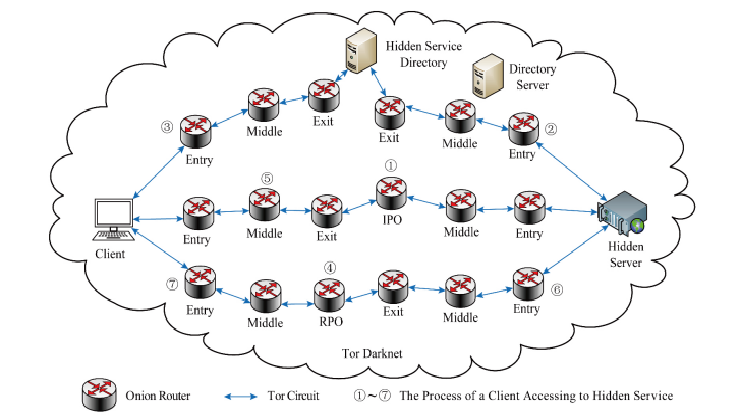

TOR有这样一些特征：

- 所有Tor数据包的大小都是相同的，以确保安全性，它们使用TLS协议进行加密，固定大小为512字节。
- 由于数据包在通过多个洋葱路由器（OR）时会经过多层加密，这使得解密变得困难，对在线匿名性构成威胁。
- 带有多重加密处理的流量阻碍了有效的监控，而Tor的匿名性增加了恶意活动的风险。


## 数据获取与分析

这次实验我们选取的是ISCX-Tor 2016数据集。这也是在Tor加密流量领域被常使用的一个数据集。

- ISCX-Tor 2016 数据集旨在生成一个具有代表性的现实世界流量数据集。该数据集包括来自超过18个代表性应用程序的流量。
- 数据集中的Tor流量是通过一个工作站虚拟机捕获的，该虚拟机通过一个网关虚拟机连接到互联网，所有流量都通过Tor网络路由。这允许研究人员每次同时捕获来自工作站和网关的出站流量，并收集两个.pcap文件：一个用于常规流量（工作站），一个用于Tor流量（网关）。
- Tor流量大小为11.8G，非Tor流量大小为8.9G。

数据集分为Tor和非Tor两部分，包含如下八种应用：

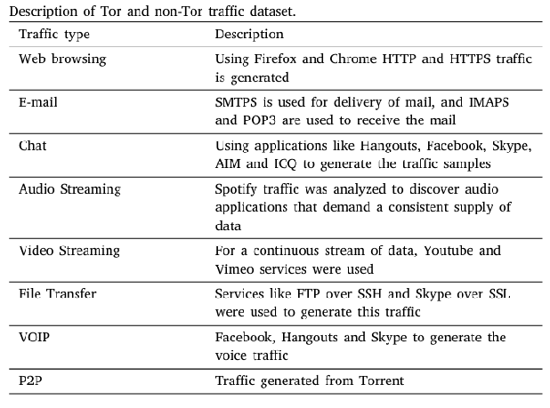

大家可以通过如下地址访问获得数据集的原始pcap： [Tor 2016 | Datasets | Research | Canadian Institute for Cybersecurity | UNB](https://www.unb.ca/cic/datasets/tor.html) 

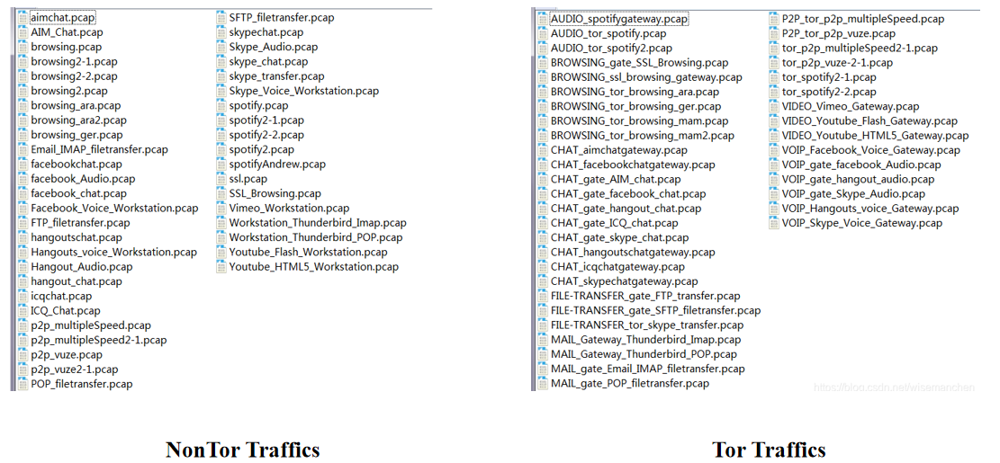

进入download页面后，分了两个文件夹。PCAP文件夹里面包含的文件如上图所示，由于20几个G的数据包实在太大不方便初学者处理分析，这里我就只展示CSV文件夹下面的分析。CSV文件夹中的数据表格其实就是在pcap文件的基础上通过CICFlowMeter抽取出来的特征。这被组织成了表格数据的形式。其中，Scenario-A的任务是为了分析流量是Tor还是非Tor，属于二分类问题；Scenario-B的任务是为了区分这些Tor流量是哪种应用产生的流量，属于多分类问题。

首先，我们分析一下特征之间的相关性，这有助于我们筛选冗余特征。

读取数据，以二分类场景为例：

```python
import pandas as pd
import numpy as np
from xgboost import XGBClassifier
from sklearn.preprocessing import MinMaxScaler, OneHotEncoder, LabelEncoder
from sklearn.model_selection import train_test_split
from sklearn.metrics import f1_score, classification_report
data=pd.read_csv("Scenario-A-merged_5s.csv")
data=data.replace([np.inf,-np.inf],np.nan)
data=data.dropna()
data.head()
```

可以看到场景A和场景B的数据简述：

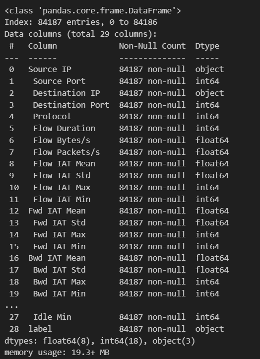

场景A还是比较多的，有8w+数据，并且正常流量比加密流量多。在这个数据里面，数值类型占了很大一部分。

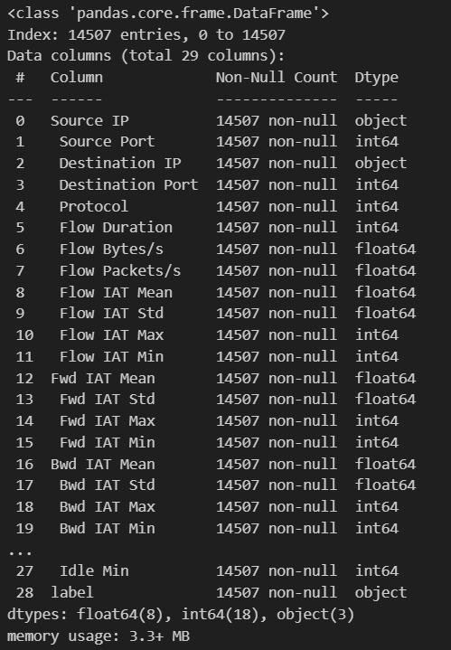

相比之下，场景B的八分类任务就显得小多了，分析起来也没那么大困难。

我们用下面的代码来绘制热力图：

```python
import numpy as np
import pandas as pd
import matplotlib as mpl
import matplotlib.pyplot as plt
import seaborn as sns
import warnings; warnings.filterwarnings(action='once')

large = 22; med = 16; small = 12
params = {'axes.titlesize': large,
          'legend.fontsize': med,
          'figure.figsize': (16, 10),
          'axes.labelsize': med,
          'axes.titlesize': med,
          'xtick.labelsize': med,
          'ytick.labelsize': med,
          'figure.titlesize': large}
plt.rcParams.update(params)
plt.style.use('seaborn-whitegrid')
sns.set_style("white")
%matplotlib inline

# Version
print(mpl.__version__)  #> 3.0.0
print(sns.__version__)  #> 0.9.0

data=data.dropna()
data.drop([])
# Plot
plt.figure(figsize=(12,10), dpi= 80)
sns.heatmap(data.corr(), xticklabels=data.corr().columns, yticklabels=data.corr().columns, cmap='RdYlGn', center=0, annot=True)

plt.xticks(fontsize=12)
plt.yticks(fontsize=12)
plt.show()
```

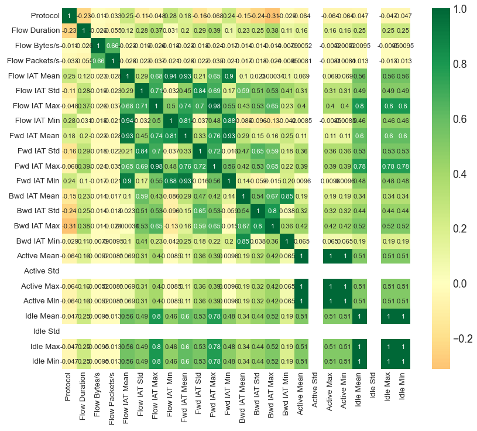

可以看到，即使特征之间的相关性还比较稀疏，但有些特征存在缺失所以是白的，有些特征之间存在高度相关性因此可以通过剔除或主成分分析对特征进行重构。这一部分大家可以自行探索。

我们还可以通过成对矩阵图来观察变量之间的关系。但由于这里变量个数太多，我就挑几个展示一下。


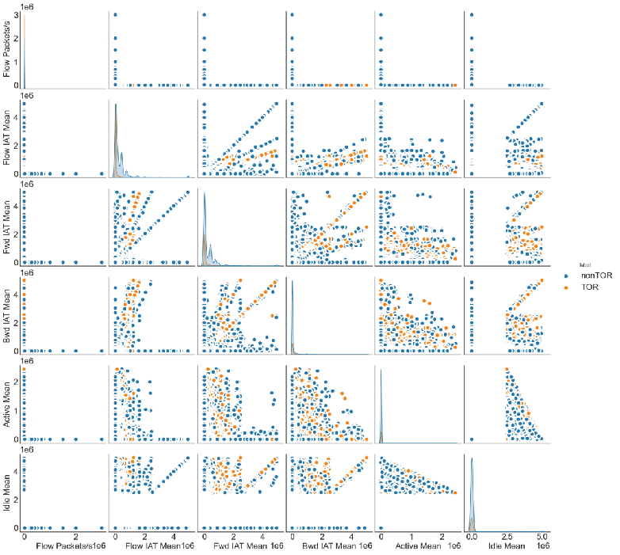

可以看到，为0的数据还是蛮多的。这是因为流量有方向性，上行流量在传输东西的时候下行流量就为0（毕竟不是真的全双工通信），这就导致数据集里面会存在大量0。那么有大量0就意味着数据会比较稀疏，用PCA或t-SNE降维会好一点。事实上，以前很多机器学习论文也是这么干的。

为了刻画网络当中不同IP之间的通联关系，可以使用networkx库对数据集中的网络进行分析。将不同的IP抽象为节点，把每个五元组看作是不同IP之间通信的边，构造网络：

```python
import networkx as nx
import matplotlib.pyplot as plt
G=nx.Graph()
users=[]
# 遍历 DataFrame 的行，并添加边到图中  
for index, row in data.iterrows():  
    source = row['Source IP']  
    target = row[' Destination IP']  
    G.add_edge(source, target)
plt.figure(figsize=(10,9),dpi=300)
pos = nx.spring_layout(G)  # 为图设置布局
nx.draw(G, pos, with_labels=True, node_color='lightblue', edge_color='gray')
plt.show()
```

得到通联关系图如图所示：


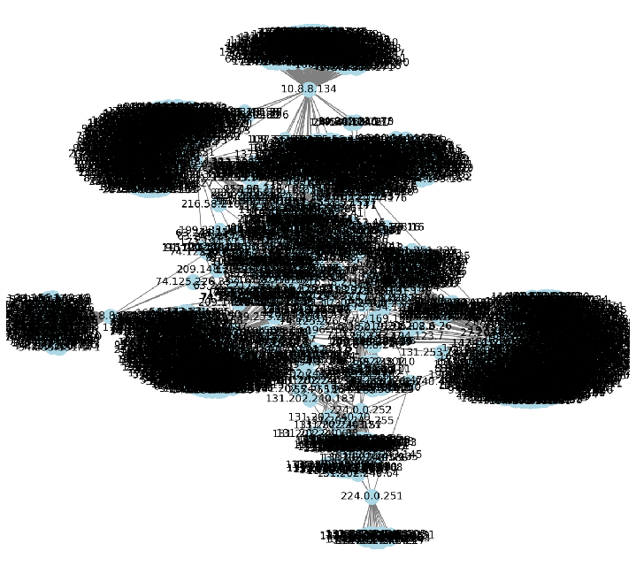

从这个图中可以看到一堆的节点连着少数几个节点，有些IP同时可以和几百个IP地址连起来导致一眼看上去乌压压黑了一大片，只有少数几个节点看得清。节点的度呈现非常典型的幂律分布，少数几个IP节点度中心性非常之强，大部分节点处在边缘的位置。

由于IP和端口都有上万个，想办法表示每个IP的结构信息似乎有点那么不太现实，并且本身这就是比较稀疏的数据，再引入更稀疏的IP和端口表示可能会造成维度爆炸现象。因此这个实验里面暂时先不考虑引入结构信息，大家可以看看近来的一些文献，想一想，怎么把图神经网络与Tor结合。

为了筛选出比较有用的特征，仍然以场景A二分类问题为例，分析不同特征的重要性。目标是一个二分类标签，可以把TOR数据和非TOR数据看作两组样本，比较两组样本中不同特征的差异性，这就是一个差异性检验问题，可以用独立样本T检验（如果不知来历推荐看看我的另一个主打项目《数学建模导论：基于Python语言》）。这里我写一下代码：

```Python
import pandas as pd
from scipy.stats import ttest_ind

tor_group = data[data['label'] == 'TOR']
non_tor_group = data[data['label'] == 'nonTOR']

# 接下来，对除了最后一列以外的每一列进行独立样本t检验
# 假设最后一列是'label'列，我们排除这一列进行t检验
columns_to_test = [col for col in data.columns if col != 'label']

# 存储t检验结果的字典
ttest_results = {}

for column in columns_to_test:
    # 进行独立样本t检验
    t_stat, p_val = ttest_ind(tor_group[column], non_tor_group[column])
    
    # 将结果存储在字典中
    ttest_results[column] = {'T-statistic': t_stat, 'P-value': p_val}

# 打印t检验结果
for column, result in ttest_results.items():
    print(f"Column: {column}")
    print(f"T-statistic: {result['T-statistic']}, P-value: {result['P-value']}")
    print("-" * 40)
```

这样，可以观察哪些特征的p<0.05从而把它们保留下来。我这里还绘制了他们的箱线图来供各位观察，顺带帮忙讲点Python绘图的内容哈哈哈。

```Python
# 创建一个画布，并设置大小
columns_to_plot = [col for col in data.columns if col != 'label']
plt.figure(figsize=(36, 8))

# 对每一列进行箱线图绘制
for i, column in enumerate(columns_to_plot, 1):
    plt.subplot(3, 8, i)
    # 绘制箱线图，hue参数用于分组
    sns.boxplot(x='label', y=column, data=data, hue='label', palette=['blue', 'orange'], dodge=False)
    # 设置标题
    plt.title(f'Boxplot of {column}')
    # 设置y轴标签
    plt.ylabel(column)
    # 显示图例
    plt.legend(title='label')

# 调整子图间距
plt.tight_layout()
# 显示图形
plt.show()
```

得到箱线图如图所示。


大家可以根据前面检验的结果和箱线图分析一下特征重要性。

除此以外，机器学习模型本身也可以作为筛选特征很好的手段之一。例如，我们在场景B具体应用分类上先跑一个XGBoost模型：

```Python
import seaborn as sns
import matplotlib.pyplot as plt

clf = XGBClassifier()
# 假设X是特征矩阵，y是标签向量
clf.fit(X, y) 

# 提取特征重要性
feature_importance = clf.feature_importances_
feature_names = data.columns[:-1]  # 假设最后一列是label，这里取除了最后一列的所有列名作为特征名

# 创建特征重要性的DataFrame
importance_df = pd.DataFrame({'Feature': feature_names, 'Importance': feature_importance})

# 对特征重要性进行排序，并取出前10个
importance_df = importance_df.sort_values(by='Importance', ascending=False).head(10)

# 绘制条形图
plt.figure(figsize=(10, 8))
plt.barh(importance_df['Feature'][::-1],importance_df['Importance'][::-1])
plt.title('Top 10 Feature Importances')
plt.xlabel('Importance')
plt.ylabel('Feature')
plt.show()
```

反正数据量也并不是那么大，全跑了也没关系。可以筛选出重要程度排名前10的特征：

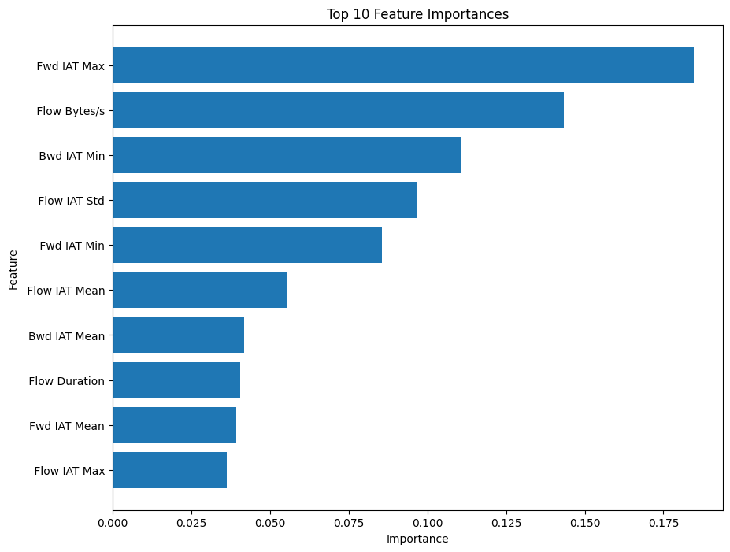

接下来我们就可以设置机器学习模型了。

## 训练机器学习模型

这里我们可以对比逻辑回归、支持向量机、决策树、随机森林、AdaBoost、GBDT、朴素贝叶斯、XGBoost等机器学习模型在Tor流量分类当中的应用。代码很简单，真的，都是五步走：切分数据，创建实例，训练数据，测试数据，评估验证。

```python
from sklearn.tree import DecisionTreeClassifier
from sklearn.svm import SVC
from sklearn.linear_model import LogisticRegression
from sklearn.ensemble import ExtraTreesClassifier, RandomForestClassifier, AdaBoostClassifier, GradientBoostingClassifier
from sklearn.naive_bayes import GaussianNB, MultinomialNB
from sklearn.metrics import accuracy_score, f1_score, precision_score, recall_score, roc_auc_score

models={'lr':LogisticRegression(),'svm':SVC(),'dt':DecisionTreeClassifier(),'etc':ExtraTreesClassifier(),'rf':RandomForestClassifier(),'adb':AdaBoostClassifier(),'gbdt':GradientBoostingClassifier(),'gnb':GaussianNB(),'mnb':MultinomialNB(),'xgb':XGBClassifier()}
for name in models.keys():
    clf=models[name]
    clf.fit(X_train,y_train)
    y_pred=clf.predict(X_test)
    print('===================={}====================='.format(name))
    print("Accuracy:%.4f"%(accuracy_score(y_test,y_pred)))
    print("F1:%.4f"%(f1_score(y_test,y_pred,average='macro')))
    print("Precision:%.4f"%(precision_score(y_test,y_pred,average='macro')))
    print("Recall:%.4f"%(recall_score(y_test,y_pred,average='macro')))
    print('/n')
```

我们把代码改改在场景AB都测一测，可以得到下面的表格：


可以看到，XGBoost大法好啊，在表格数据上效果杠杠的。场景A的二分类任务效果普遍是好一些，通过少数几个特征就可以做到0.99以上的准确率。但如果做的是多分类任务，区分具体应用流量的时候这个效果打折就很离谱了。最好的准确率也只做到了0.8656。以往的一些研究反映XGBoost在Tor流量分类的时候往往是查准率低召回率高，我这里比较相反，也可能是没有经过调参的缘故。

那我们怎么对XGBoost进行调参呢？大家可以试试运行下面的代码：

```python
import xgboost as xgb
from sklearn.model_selection import GridSearchCV, train_test_split
from sklearn.metrics import classification_report
from sklearn.datasets import make_classification
from sklearn.multiclass import OneVsRestClassifier

# 划分训练集和测试集
X_train, X_test, y_train, y_test = train_test_split(X, y, test_size=0.2, random_state=42)

# 设置XGBoost分类器
xgb_clf = xgb.XGBClassifier(use_label_encoder=False, eval_metric='mlogloss')

# 设置网格搜索的参数范围
param_grid = {
    'max_depth': [3, 4, 5],
    'n_estimators': [100, 150, 200],
    'learning_rate': [0.01, 0.05, 0.1],
    'subsample': [0.8, 0.9, 1.0],
    'colsample_bytree': [0.8, 0.9, 1.0]
}

# 使用OneVsRestClassifier包装XGBoost分类器以进行多分类
clf = OneVsRestClassifier(xgb_clf)

# 设置网格搜索
grid_search = GridSearchCV(estimator=clf, param_grid=param_grid, cv=3, scoring='accuracy', verbose=1)

# 执行网格搜索
grid_search.fit(X_train, y_train)

# 最佳参数和最佳模型
print("Best parameters:", grid_search.best_params_)
best_clf = grid_search.best_estimator_

# 使用测试集评估模型
y_pred = best_clf.predict(X_test)

# 打印分类报告
print(classification_report(y_test, y_pred))

```

大家可以尝试跑一跑。

## 试着使用深度学习模型

那么如何用上深度学习模型呢？大家对深度学习感兴趣的，可以看看DataWhale的PyTorch教程和动手学深度学习。除此以外，DW三剑客王琦博士、杨毅远博士和江季老师整理的《深度学习详解》也是学习深度学习很好的材料。我这里以一个简单的全连接神经网络为例，在Tor表格数据上进行分类。大家按照Torch安装教程配置好环境后，可以无脑执行下面的代码。因为本身数据量不大，所以即使是CPU环境执行也不会有什么问题：

```python
import torch  
import torch.nn as nn  
import torch.optim as optim  
from torch.utils.data import DataLoader, TensorDataset, random_split  
from sklearn.metrics import accuracy_score, f1_score, recall_score, precision_score, roc_auc_score
 
input_dim = 24  
num_classes = 8 

loaded_dataset = torch.load('dataset_new.pth')
train_dataset = TensorDataset(loaded_dataset['train_input'],loaded_dataset['train_label'])
test_dataset = TensorDataset(loaded_dataset['test_input'],loaded_dataset['test_label'])
  
# 创建DataLoader  
batch_size = 32  
train_loader = DataLoader(train_dataset, batch_size=batch_size, shuffle=True)  
test_loader = DataLoader(test_dataset, batch_size=batch_size, shuffle=False)  
  
class DNN(nn.Module):
    def __init__(self, input_dim=24, hidden_dim1=128, hidden_dim2=64, output_dim=8):
        super(DNN, self).__init__()
        # 第一个隐藏层
        self.fc1 = nn.Linear(input_dim, hidden_dim1)
        # 第二个隐藏层
        self.fc2 = nn.Linear(hidden_dim1, hidden_dim2)
        # 输出层
        self.fc3 = nn.Linear(hidden_dim2, output_dim)

        self.activate1=nn.ReLU()
        self.activate2=nn.ReLU()
        self.activate3=nn.Softmax()

    def forward(self, x):
        # 输入x通过第一个隐藏层
        x = self.activate1(self.fc1(x))
        # 第一个隐藏层的输出通过第二个隐藏层
        x = self.activate2(self.fc2(x))
        # 第二个隐藏层的输出通过输出层
        x = self.activate3(self.fc3(x))
        return x  
  
# 初始化模型、损失函数和优化器  
model = DNN(input_dim, output_dim=num_classes)  
criterion = nn.BCELoss()  # 二分类交叉熵损失，适用于独热编码  
optimizer = optim.Adam(model.parameters(), lr=0.001)  
  
# 训练模型  
num_epochs = 50
for epoch in range(num_epochs):  
    model.train()  
    running_loss = 0.0  
    for inputs, labels in train_loader:  
        optimizer.zero_grad()  
        outputs = model(inputs)  
        loss = criterion(outputs, labels)  
        loss.backward()  
        optimizer.step()  
        running_loss += loss.item()  
      
    print(f'Epoch [{epoch+1}/{num_epochs}], Loss: {running_loss/len(train_loader):.4f}')  
  
# 测试模型  
model.eval()  
correct = 0  
total = 0  
all_labels=[]
all_preds=[]
outputs_prob=[]
with torch.no_grad():  
    for inputs, labels in test_loader:  
        outputs = model(inputs)  
        outputs_prob.extend(outputs.numpy().max(axis=1))
        _, predicted = torch.max(outputs.data, 1)  
        all_preds.extend(predicted.numpy())
        all_labels.extend(labels.numpy().argmax(axis=1))
  
# 计算准确率
accuracy = accuracy_score(all_labels, all_preds)
print(f'Accuracy: {accuracy:.4f}')

# 计算F1分数
f1 = f1_score(all_labels, all_preds, average='macro')
print(f'F1 Score: {f1:.4f}')

# 计算查准率
precision = precision_score(all_labels, all_preds, average='macro')
print(f'Precision: {precision:.4f}')

# 计算召回率
recall = recall_score(all_labels, all_preds, average='macro')
print(f'Recall: {recall:.4f}')
```

这个例子当中我们把PyTorch构建神经网络分成几个部分。首先，是写数据集和DataLoader，这往往是Torch最令人抓狂的一环，比较繁琐，但是很重要非常重要。由于我给大家已经整理好了，所以其实这一块难度不大。

第二个部分是构建模型并初始化。在DNN类当中，构造函数里面声明我们的模型要用到的每一层，然后在forward方法当中把每一层拼接起来。当然，如果是Tensorflow 2.x或Keras玩家，也可以使用Sequential 方法来构造。同时，我们还声明了面向分类问题的损失函数和优化器。

第三个部分是训练部分。一句model.train()告诉大家，你开始训练了，然后开始zero_grad计算梯度，backward()反向传播。这一块框架大同小异，大家都差不多。

第四个部分是测试部分，给出预测结果。

大家可以测试一下，看一看，深度学习方法就一定比机器学习好吗？

## 进阶篇：试试用计算机视觉？

我这里给大家展示一点小操作，用计算机视觉的方法来做Tor流量分类。本质上这是个迁移学习，我们也不会从头开始训练一个卷积神经网络，而是用了预训练权重。由于20几个G的pcap文件数量巨大，我这里就只拿两个小pcap包带大家跑个demo，让大家能够分类一下Tor和非Tor好吧。我之前真做实验的时候还特地租了个AutoDL的服务器，大家如果有兴趣把全体数据跑完也可以这么干哈哈。

- 将PCAP文件转换为原始字节流：从PCAP文件中提取每个数据包的原始字节数据，这些数据可以在后续阶段直接映射到图像像素的灰度值（0-255）。

+ 将字节流转换为图像
  - 将这些字节转换为二维矩阵，然后将其转换为灰度或RGB图像。
  - 如果数据包长度不统一，可以对数据包应用零填充或截断。

大家可以参考如下代码跑个自己的demo。

```Python
import os.path

from scapy.all import rdpcap
import numpy as np
from PIL import Image

# 读取pcap文件并提取字节流
def pcap2bytes(pcap_file,max_len=784): # 默认最大长度为784,即28*28,用于确定图片大小
    packets = rdpcap(pcap_file)
    bytes_list = []

    # 提取字节流
    for packet in packets:
        raw_bytes=bytes(packet) # 将数据包转换为字节序列
        # print("raw_bytes:",raw_bytes)
        print("len(raw_bytes):",len(raw_bytes))
        print("===============================")
        byte_array=list(raw_bytes)
        if len(byte_array)<max_len//2:
            continue
        # 如果数据包长度小于最大长度，则在末尾补0;如果数据包长度大于最大长度，则截断
        if len(byte_array)<max_len:
            byte_array+=[0]*(max_len-len(byte_array))
        else:
            byte_array=byte_array[:max_len]
        bytes_list.append(byte_array)
    return bytes_list

# 将一个数据包的字节流转换为图片并保存
def bytes2image(byte_list,image_name):
    # 将一维的字节流转换为二维的灰度图
    img=np.array(byte_list).reshape(28,28)
    img=Image.fromarray(img.astype(np.uint8)) # 将numpy数组转换为PIL图像
    img.save(image_name)

#将每张图片保存到本地
def save_images(bytes_list):
    for idx,byte_list in enumerate(bytes_list):
        image_name=os.path.join("./mdata/video_streaming",f"image_{idx}.png")
        bytes2image(byte_list,image_name)
        print(f"Save {image_name} successfully!")

# 读取pcap文件并提取字节流
pcap_file="./Tor-nonTor/video_streaming/VIDEO_Youtube_HTML5_Gateway.pcap"
bytes_list=pcap2bytes(pcap_file)
# 将每张图片保存到本地
save_images(bytes_list)
```

得到的图像效果如图所示。事实上很多数据包是被截断或者大批量补0的，这个流图构造方法其实还很草率，但对初学者而言已经可以做到足够好的效果了。

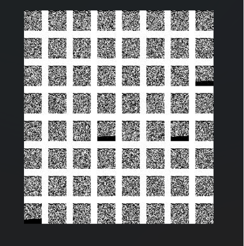

大家可以参考下面的resnet-18代码，基于ImageNet上的预训练权重来迁移学习来适应Tor流量分类任务。其中，由于我们的图像是28*28的大小，但ResNet-18规范的输入是224 * 224，所以我们还需要进行一步图像变换操作给它来个缩放。

```Python
import os
import torch
from torch.utils.data import Dataset, DataLoader, random_split
from PIL import Image
import torchvision
import torchvision.transforms as transforms
from torchvision import datasets, models
from sklearn.metrics import accuracy_score, f1_score, recall_score, precision_score, roc_auc_score
from tqdm import tqdm

class CustomDataset(Dataset):
    def __init__(self, root_dir, transform=None):
        self.root_dir = root_dir
        self.transform = transform
        self.images = []
        self.labels = []

        for label, directory in enumerate(['Tor', 'NonTor']):
            for img_name in os.listdir(os.path.join(root_dir, directory)):
                self.images.append(os.path.join(root_dir, directory, img_name))
                self.labels.append(label)

    def __len__(self):
        return len(self.images)

    def __getitem__(self, idx):
        img_path = self.images[idx]
        image = Image.open(img_path).convert('L')
        label = self.labels[idx]

        if self.transform:
            image = self.transform(image)

        return image, label

# MNIST数据集转换为三通道
transform = transforms.Compose([
    transforms.Grayscale(num_output_channels=3),
    transforms.ToTensor(),
    transforms.Normalize((0.1307,), (0.3081,))
])

# 创建Dataset实例
dataset = CustomDataset(root_dir='./data', transform=transform)

# 确定训练集和测试集的大小
total_size = len(dataset)
train_size = int(0.8 * total_size)  # 80%的数据用作训练
test_size = total_size - train_size  # 剩余的20%用作测试

# 随机分割数据集
train_dataset, test_dataset = random_split(dataset, [train_size, test_size])

# 创建DataLoader实例
train_loader = DataLoader(train_dataset, batch_size=64, shuffle=True, num_workers=4)
test_loader = DataLoader(test_dataset, batch_size=64, shuffle=False, num_workers=4)
print("数据加载完成！")

# 设置设备
device = torch.device("cuda" if torch.cuda.is_available() else "cpu")
print("使用设备",device)

# 加载预训练的resnet18模型
model = models.resnet18(pretrained=True)

num_ftrs = model.fc.in_features
model.fc = torch.nn.Linear(num_ftrs, 2)

# 将模型发送到设备
model = model.to(device)
print("模型加载完成！")

# 设置损失函数和优化器
criterion = torch.nn.CrossEntropyLoss()
optimizer = torch.optim.SGD(model.parameters(), lr=0.001, momentum=0.9)

# 训练模型
num_epochs = 5
for epoch in range(num_epochs):
    running_loss = 0.0
    for images, labels in tqdm(train_loader):
        images, labels = images.to(device), labels.to(device)

        optimizer.zero_grad()

        output = model(images)
        loss = criterion(output, labels)
        loss.backward()
        optimizer.step()

        running_loss += loss.item()
    print(f'Epoch {epoch+1}, Loss: {running_loss/len(train_loader)}')

print('Finished Training')

# 测试模型
correct = 0
total = 0
all_labels=[]
all_preds=[]
outputs_prob=[]
with torch.no_grad():
    for images, labels in test_loader:
        images, labels = images.to(device), labels.to(device)
        outputs = model(images)
        _, predicted = torch.max(outputs.data, 1)  
        all_preds.extend(predicted.cpu().numpy())
        all_labels.extend(labels.cpu().numpy())
        total += labels.size(0)
        correct += (predicted == labels).sum().item()

print(f'Accuracy of the network on the test images: {100 * correct / total}%')

# 计算准确率
accuracy = accuracy_score(all_labels, all_preds)
print(f'Accuracy: {accuracy:.6f}')

# 计算F1分数
f1 = f1_score(all_labels, all_preds, average='macro')
print(f'F1 Score: {f1:.6f}')

# 计算查准率
precision = precision_score(all_labels, all_preds, average='macro')
print(f'Precision: {precision:.6f}')

# 计算召回率
recall = recall_score(all_labels, all_preds, average='macro')
print(f'Recall: {recall:.6f}')

```

看看效果究竟如何呢？


起立，请全体起立！为ResNet献上一杯卡布基诺。

## 进阶篇：试试用大语言模型？

LLM在加密流量领域也有非常好的应用了现在。这里我想介绍清华大学和中关村实验室联合发布的一项重磅工作：Traffic-LLM。

Traffic-LLM旨在解决在有限的历史流量数据中实现高精度加密流量分类的问题。它利用预训练的大型语言模型（LLMs）的强大能力以及从小样本中学习的特点，以提高加密流量分类任务的准确性和泛化能力。

方法：

- 利用预训练的大型语言模型（LLMs）：LLMs在大规模数据集上进行预训练，以捕捉通用模式和信息，使它们能够快速适应新的下游任务，即使这些任务的训练数据有限。
- 设计两个输入嵌入模块：为了让预训练的LLMs处理流量数据，论文设计了一个输入嵌入模块，包括一个序列嵌入层和一个图嵌入层。序列嵌入层使用CNN处理时间序列数据，提取时间依赖性；图嵌入层使用GCN处理道路网络的图结构数据，提取空间依赖性。
- LoRA微调：模型使用低秩适应（LoRA）方法进行微调，以提高训练效率并减少计算需求。


首先，我们通过github链接把它克隆下来，这里我租了个AutoDL的服务器，4090单卡。

 [TrafficLLM/README.md at master · ZGC-LLM-Safety/TrafficLLM](https://github.com/ZGC-LLM-Safety/TrafficLLM/blob/master/README.md) 

这里面教程还是蛮详细的，大家对照着它来配置部署就很好。

克隆好了以后，可以安装有关包：

```powershell
conda create -n trafficllm python=3.9

conda activate trafficllm

# Clone our TrafficLLM
git clone https://github.com/ZGC-LLM-Safety/TrafficLLM.git
cd TrafficLLM
# Install required libraries
pip install -r requirements.txt
# If training
pip install rouge_chinese nltk jieba datasets
```

第二步就是部署大模型基座了。打开models文件夹，把模型部署到里面来。这里他们所使用的基座模型是ChatGLM2-6B模型，我也是通过Datawhale的Self-LLM教程来部署的。这里必须给宋·高锰酸钾·不要葱姜蒜·志学博士打个广告了，在self-llm找到对应的入口三分钟就可以部署好。

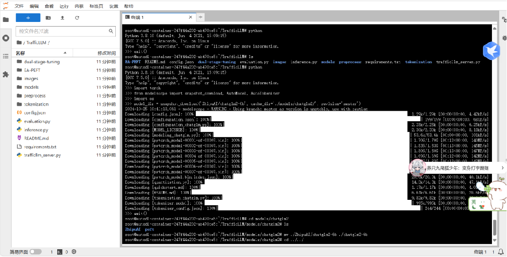

checkpoint搞好了大概是这样的。

后面的操作基本上是在自己的流量数据集上训练或微调的操作了。由于我们使用的ISCX-Tor2016数据集他们已经预训练过了，所以我们就不动手自己调了，有兴趣的朋友可以试一试。这里我们把instruction的json数据放到dataset里面去。

打开config.json文件，把内容修改成这样：

```json
{
    "model_path": "models/chatglm2/chatglm2-6b/",
    "peft_path": "models/chatglm2/peft/",
    "peft_set": {
      "NLP": "instruction/checkpoint-8000/",
      "MTD": "ustc-tfc-2016-detection-packet/checkpoint-10000/",
      "BND": "iscx-botnet-2014-detection-packet/checkpoint-5000/",
      "WAD": "csic-2010-detection-packet/checkpoint-6000/",
      "AAD": "dapt-2020-detection-packet/checkpoint-20000/",
      "EVD": "iscx-vpn-2016-detection-packet/checkpoint-4000/",
      "TBD": "iscx-tor-2016-detection-packet/checkpoint-10000/"
    },
    "tasks": {
      "Malware Traffic Detection": "MTD",
      "Botnet Detection": "BND",
      "Web Attack Detection": "WAD",
      "APT Attack Detection": "AAD",
      "Encrypted VPN Detection": "EVD",
      "Tor Behavior Detection": "TBD"
    }
}
```

我们用命令行格式跑个测试看看：

```shell
python evaluation.py --model_name /Your/Base/Model/Path --traffic_task detection --test_file datasets/ustc-tfc-2016/ustc-tfc-2016_detection_packet_test.json --label_file datasets/ustc-tfc-2016/ustc-tfc-2016_label.json --ptuning_path models/chatglm2/peft/ustc-tfc-2016-detection-packet/checkpoints-20000/
```

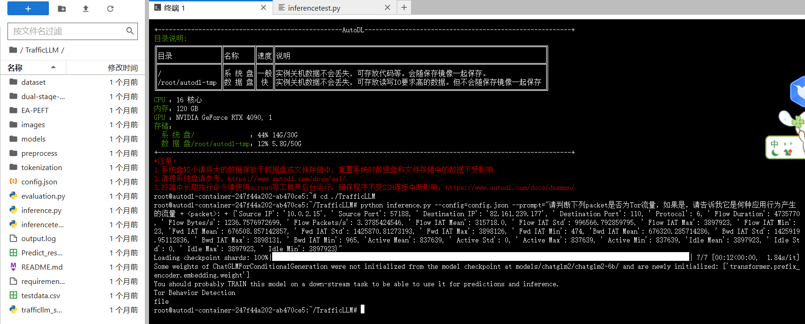

诶，你看，它的输入是分了两步走的，一步是分析这是个什么任务（因为TrafficLLM可以针对多种加密流量任务去跑，你得确定你分析的是Tor），第二步分析这个是什么流量（文件类型）。

如果你觉得一条条评测麻烦，也可以试试下面的评测代码，仿着inference.py改的。

```python
from transformers import AutoTokenizer, AutoModel, AutoConfig
import fire
import torch
import json
import os
import pandas as pd

os.environ["CUDA_VISIBLE_DEVICES"] = "0"


def load_model(model, ptuning_path):
    if ptuning_path is not None:
        prefix_state_dict = torch.load(
            os.path.join(ptuning_path, "pytorch_model.bin"))
        new_prefix_state_dict = {}
        for k, v in prefix_state_dict.items():
            if k.startswith("transformer.prefix_encoder."):
                new_prefix_state_dict[k[len("transformer.prefix_encoder."):]] = v
        model.transformer.prefix_encoder.load_state_dict(new_prefix_state_dict)

        model = model.half().cuda()
        model.transformer.prefix_encoder.float()

    return model


def prompt_processing(prompt):
    instruction_text = prompt.split("<packet>")[0]
    traffic_data = "<packet>" + "<packet>".join(prompt.split("<packet>")[1:])

    return instruction_text, traffic_data


def preprompt(task, traffic_data):
    """Preprompts in LLMs for downstream traffic pattern learning"""
    prepromt_set = {
        "MTD": "Given the following traffic data <packet> that contains protocol fields, traffic features, and "
               "payloads. Please conduct the ENCRYPTED MALWARE DETECTION TASK to determine which application "
               "category the encrypted beign or malicious traffic belongs to. The categories include 'BitTorrent, "
               "FTP, Facetime, Gmail, MySQL, Outlook, SMB, Skype, Weibo, WorldOfWarcraft,Cridex, Geodo, Htbot, Miuref, "
               "Neris, Nsis-ay, Shifu, Tinba, Virut, Zeus'./n",
        "BND": "Given the following traffic data <packet> that contains protocol fields, traffic features, "
               "and payloads. Please conduct the BOTNET DETECTION TASK to determine which type of network the "
               "traffic belongs to. The categories include 'IRC, Neris, RBot, Virut, normal'./n",
        "WAD": "Classify the given HTTP request into normal and abnormal categories. Each HTTP request will consist "
               "of three parts: method, URL, and body, presented in JSON format. If a web attack is detected in an "
               "HTTP request, please output an 'exception'. Only output 'abnormal' or 'normal', no additional output "
               "is required. The given HTTP request is as follows:/n",
        "AAD": "Classify the given HTTP request into normal and abnormal categories. Each HTTP request will consist "
               "of three parts: method, URL, and body, presented in JSON format. If a web attack is detected in an "
               "HTTP request, please output an 'exception'. Only output 'abnormal' or 'normal', no additional output "
               "is required. The given HTTP request is as follows:/n",
        "EVD": "Given the following traffic data <packet> that contains protocol fields, traffic features, "
               "and payloads. Please conduct the encrypted VPN detection task to determine which behavior or "
               "application category the VPN encrypted traffic belongs to. The categories include 'aim, bittorrent, "
               "email, facebook, ftps, hangout, icq, netflix, sftp, skype, spotify, vimeo, voipbuster, youtube'./n",
        "TBD": "Given the following traffic data <packet> that contains protocol fields, traffic features, and "
               "payloads. Please conduct the TOR BEHAVIOR DETECTION TASK to determine which behavior or application "
               "category the traffic belongs to under the Tor network. The categories include 'audio, browsing, chat, "
               "file, mail, p2p, video, voip'./n"
    }
    if task == "AAD":
        prompt = prepromt_set[task] + traffic_data.split("<packet>:")[1]
    else:
        prompt = prepromt_set[task] + traffic_data
    return prompt


def test(config, prompt: str = None, **kwargs):
    instruction_text, traffic_data = prompt_processing(prompt)

    with open(config, "r", encoding="utf-8") as fin:
        config = json.load(fin)

    tokenizer = AutoTokenizer.from_pretrained(config["model_path"], trust_remote_code=True)
    model_config = AutoConfig.from_pretrained(config["model_path"], trust_remote_code=True, pre_seq_len=128)
    model = AutoModel.from_pretrained(config["model_path"], config=model_config, trust_remote_code=True)

    # Stage 1: task understanding
    ptuning_path = os.path.join(config["peft_path"], config["peft_set"]["NLP"])
    model_nlp = load_model(model, ptuning_path)

    model_nlp = model_nlp.eval()

    response, history = model_nlp.chat(tokenizer, instruction_text, history=[])
    print(response)

    # Stage 2: task-specific traffic learning
    task = config["tasks"][response]
    ptuning_path = os.path.join(config["peft_path"], config["peft_set"][task])
    model_downstream = load_model(model, ptuning_path)

    model_downstream = model_downstream.eval()

    traffic_prompt = preprompt(task, traffic_data)
    response, history = model_downstream.chat(tokenizer, traffic_prompt, history=[])
    print(response)
    return response

data=pd.read_csv("testdata.csv")
result=[]

with open("config.json", "r", encoding="utf-8") as fin:
     config = json.load(fin)

tokenizer = AutoTokenizer.from_pretrained(config["model_path"], trust_remote_code=True)
model_config = AutoConfig.from_pretrained(config["model_path"], trust_remote_code=True, pre_seq_len=128)
model = AutoModel.from_pretrained(config["model_path"], config=model_config, trust_remote_code=True)

for i in range(data.shape[0]):
    print("=========================测试第{%d}条数据========================="%i)
    prompt=data['instruction'][i]
    instruction_text, traffic_data = prompt_processing(prompt)

    # Stage 1: task understanding
    ptuning_path = os.path.join(config["peft_path"], config["peft_set"]["NLP"])
    model_nlp = load_model(model, ptuning_path)
    model_nlp = model_nlp.eval()

    response, history = model_nlp.chat(tokenizer, instruction_text, history=[])
    print(response)

    # Stage 2: task-specific traffic learning
    task = config["tasks"][response]
    ptuning_path = os.path.join(config["peft_path"], config["peft_set"][task])
    model_downstream = load_model(model, ptuning_path)

    model_downstream = model_downstream.eval()

    traffic_prompt = preprompt(task, traffic_data)
    response, history = model_downstream.chat(tokenizer, traffic_prompt, history=[])
    print(response)
    result.append(response)
pd.DataFrame(result).to_csv("Predict_result.csv")

```

大家可以试试，看看效果如何呢？
